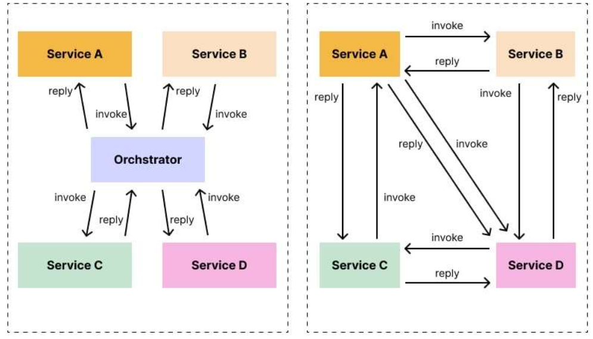
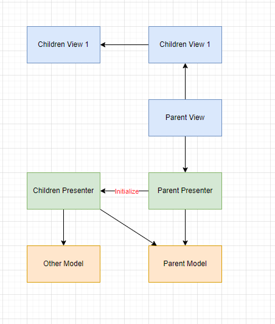

#

## 1. Kiến trúc MVP cho sub-component

- Trong phần này, ta sẽ dựa trên 2 pattern của SAGA pattern

_SAGA pattern: choreography vs orchestration_

- Hai cách sử dụng MVP cho component con và component cha
  - Khởi tạo trực tiếp presenter con ngay tại view con
  - Presenter cha làm trung tâm điều phối, khởi tại các presenter con trong cha

### 1.1. Khởi tạo trực tiếp presenter con ngay tại component con

- **Mô tả luồng**: Tình huống component con thay đổi và component cha cũng thay đổi theo
  - Khi view con thay đổi thì nó sẽ thông báo user action đến presenter con
  - Presenter con thông báo phần dữ liệu thay đổi cho model cha
  - Presenter cha sẽ nhận event theo dõi sự thay đổi từ model bắn lên cho presenter cha
  - Presenter cha cập nhật view cha

- **Ưu điểm**:
  - Các component có tính độc và tái sử dụng cao
  - Trong trường hợp component truyền qua nhiều tầng, ta không phải bắn sự kiện nhiều tầng từ component con lên cha và tổ tiên mà ta thay đổi trực tiếp rồi thông báo cho một component khác muốn thay đổi theo

- **Nhược điểm**:
  - Khi các presenter con thay đổi thì presenter cha không biết được bên trong presenter con thay đổi ở đâu mà chỉ biết được dữ liệu từ model thay đổi

- **Cách sử dụng**: Sử dụng khi các component con và component cha ít tương tác với nhau

### 1.2. Presenter cha làm trung tâm điều phối, khởi tại các presenter con trong cha

- Sử dụng khi các component con và component cha tương tác với nhau nhiều

- **Mô tả luồng**: Tình huống component con thay đổi và component cha cũng thay đổi theo
  - Khi view con thay đổi thì sẽ bắn sự kiện lên view cha
  - View cha sẽ thông báo sự kiện đó về presenter cha
  - Presenter cha điều phối về presenter con mà view con đã bắn sự kiện lên
  - Presenter con xử lý và thông báo thay đổi dữ liệu cho model, gửi cập nhật UI lên cho presenter cha
  - Presenter cha gửi thông báo cập nhật cho view cha
  - View cha truyền thay đổi xuống view con

- **Ưu điểm**:
  - Có thể biết được những hoạt động thay đổi bên trong presenter nhờ presenter cha điều phối

- **Nhược điểm**:
  - Trong trường hợp component truyền qua nhiều tầng, cần phải thao tác với nhiều vị trí cho mỗi sự kiện cần bắn lên cha và tô tiên (Giải pháp cho việc bắn sự kiện qua nhiều tầng: Có thể bắn sự kiện trực tiếp lên component cha thông qua event bus)
  - Mỗi View con đều có interface khi đó việc implement interface từ nhiều component sẽ phình to lên
  - Logic điều phối các component ở presenter cũng tạo ra khối lượng code lớn

- **Cách sử dụng**: Sử dụng cho các component con và component cha có sự tương tác cao
